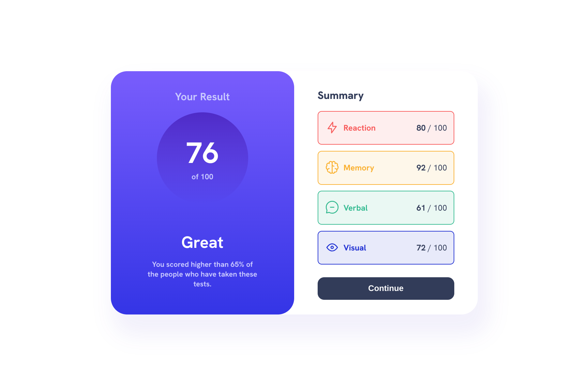
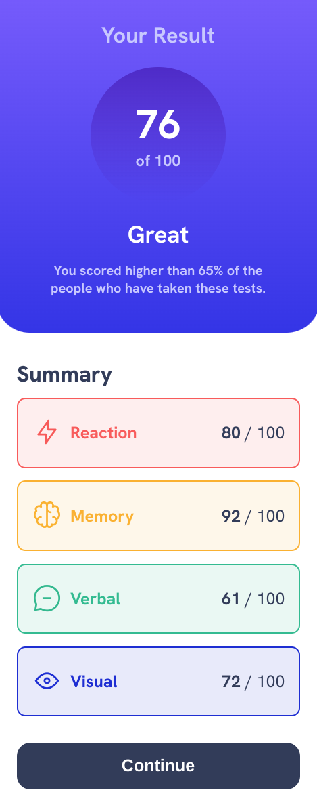

# Frontend Mentor - Results summary component solution

This is a solution to the [Results summary component challenge on Frontend Mentor](https://www.frontendmentor.io/challenges/results-summary-component-CE_K6s0maV). Frontend Mentor challenges help you improve your coding skills by building realistic projects. 

## Table of contents

- [Overview](#overview)
  - [The challenge](#the-challenge)
  - [Screenshot](#screenshot)
  - [Links](#links)
- [My process](#my-process)
  - [Built with](#built-with)
  - [Continued development](#continued-development)
- [Author](#author)

## Overview

### The challenge

Users should be able to:

- View the optimal layout for the interface depending on their device's screen size
- See hover and focus states for all interactive elements on the page
- **Bonus**: Use the local JSON data to dynamically populate the content

### Screenshot
<ins>Frontend Mentor's Desktop Design</ins>:

<ins>My Desktop Solution</ins>:

<ins>Frontend Mentor's Mobile Design</ins>:

<ins>My mobile solution</ins>:

### Links

- Solution URL: [GitHub](https://github.com/moonji-spoonji/Results-Summary-Component)
- Live Site URL: [Netlify](https://results-summary-profile-moonji.netlify.app/)

## My process

### Built with

- Semantic HTML5 markup
- CSS custom properties
- Flexbox
- CSS Grid

### Continued development

One thing I would like to work on more is Figma design. Though unrelated, I think workingn with Figma will help me to better plan out how to code it. 

## Author

- Frontend Mentor - [@moonji-spoonji](https://www.frontendmentor.io/profile/moonji-spoonji)

